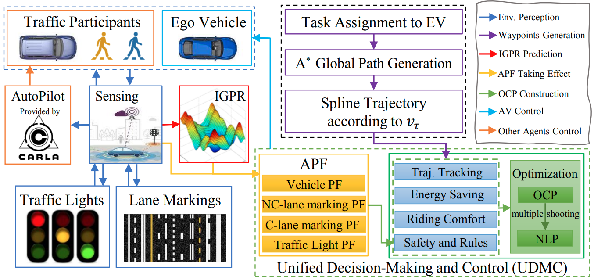
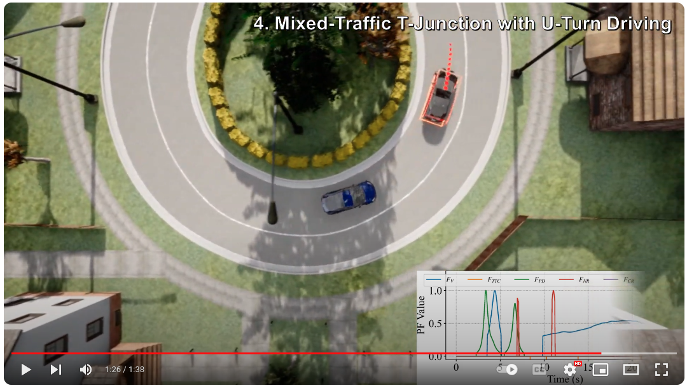

# UDMC: Unified Decision-Making and Control Framework for Urban Autonomous Driving with Motion Prediction of Traffic Participants
[](https://github.com/henryhcliu/udmc_carla/blob/main/LICENSE)
[](https://github.com/henryhcliu/udmc_carla/releases/tag/v1.0)
[](https://arxiv.org/abs/2501.02530)

> This autonomous driving framework (named UDMC) is based on nonparametric Bayesian learning and optimization methods, so it is lightweight, interpretable, and adaptable to various driving scenarios.

> Live demo: [https://www.youtube.com/watch?v=jftTsf1jXjU](https://www.youtube.com/watch?v=jftTsf1jXjU).

> Preprint: [https://arxiv.org/abs/2501.02530](https://arxiv.org/abs/2501.02530).

> The paper has been published in **IEEE Transactions on Intelligent Transportation Systems (T-ITS)** and can be accessed [here](https://ieeexplore.ieee.org/document/10942456).

## Table of Contents
* [General Info](#general-information)
* [Technologies Used](#technologies-used)
* [Features](#features)
* [Driving Demo](#driving-demo-in-the-first-person-view)
* [Setup](#setup)
* [Usage](#usage)
* [File Structure](#file-structure)
* [Project Status](#project-status)
* [Acknowledgements](#acknowledgements)
* [Contact](#contact)
* [License](#license)


## General Information
<!-- Insert the udmc_structure.png figure using 0.5\width width -->

<div style="text-align:center;">
  
</div>

- This project contains the necessary code for our presented Unified Decision-Making and Control (UDMC) scheme for urban driving. 
- The purpose of this project is to build a uniformed, versatile and light-weighted autonomous driving framework for both decision-making and motion control.
- This driving framework settles the complex traffic rule compliance problem using the artificial potential field (APF), rather than if-else commands in most current rule-based methods.
- We tested it on varieties of scenarios (car following, overtaking, roundabout, intersection, T-junction, etc.) and `CARLA Town05 Benchmark`.
<!-- You don't have to answer all the questions - just the ones relevant to your project. -->


## Technologies Used
- Ubuntu 20.04
- Python 3.8 with `requirements.txt`
- CasADi 3.6.3
- CARLA 0.9.14


## Features
- Lightweight Design
- Interpretability
- Broad Applicability for Urban Road Networks
- Compliance with Traffic Regulations


## Driving Demo

### Driving Demo in the First-Person View
<!-- insert the roundabout_animation.gif file here -->


### Driving Demo in the Bird's-Eye View
<!-- insert the .png file with a link of the YouTube video -->
[](https://www.youtube.com/watch?v=jftTsf1jXjU)


## Setup
Install anaconda
```Shell
wget https://repo.anaconda.com/archive/Anaconda3-2020.11-Linux-x86_64.sh
bash Anaconda3-2020.11-Linux-x86_64.sh
source ~/.profile
```

Clone the repo and build the environment
```Shell
git clone https://github.com/henryhcliu/udmc_carla.git
cd udmc_carla
conda create -n udmc_carla python=3.8
conda activate udmc_carla
pip3 install -r requirements.txt
```

Download and setup CARLA 0.9.14
```Shell
sudo apt-key adv --keyserver keyserver.ubuntu.com --recv-keys 1AF1527DE64CB8D9
sudo add-apt-repository "deb [arch=amd64] http://dist.carla.org/carla $(lsb_release -sc) main"
sudo apt-get update # Update the Debian package index
sudo apt-get install carla-simulator=0.9.14 # Install the 0.9.14 CARLA version
cd /opt/carla-simulator # Open the folder where CARLA is installed
./CarlaUE4.sh
```

## Usage
Before running the following codes, CARLA Simulator should be active.
```Shell
cd /opt/carla-simulator # Open the folder where CARLA is installed
./CarlaUE4.sh
```
In another terminal:
```Shell
cd udmc_carla # Open the folder where this repository exists
```
### Run the UDMC with different driving scenario settings and surrounding vehicle spawn options
```Shell 
# Multilane ACC driving with randomly generated surrounding vehicles
python udmc_main.py multilaneACC True

# Roundabout driving with randomly generated surrounding vehicles
python udmc_main.py roundabout True

# Crossroad driving with randomly generated surrounding vehicles
python udmc_main.py crossroad True

# Unsignalized crossroad driving with randomly generated surrounding vehicles
python udmc_main.py unsig_crossroad True

# T-junction driving with pedestrians and randomly generated surrounding vehicles
python udmc_main.py mixed_traffic True
```
With runing the above command lines, the randomly generated initial spawn points of the traffic participants will be recorded in the folder `spawnPoints`. If you want to spawn surrounding vehicles with certain spawn points (to test the performance of different methods under the same condition), please change the last argument to `False`.

### Run the Parameter Identification of the vehicle dynamics model
```Shell
python param_est_using_slsqp.py
```
** Note:** The ploted figures contains four subplots:
1. The accumulated error of the x and y coordinates.
2. The ground truth and accumulated estimated route.
3. The sliding window-based error of the x and y coordinates.
4. The ground truth and estimated route using sliding window-based estimation.
The subfigures 3 and 4 are more suitable for the evaluation of the sliding window-based motion planning and control method.

Please also note that the collected data `data_w_real_steer_70_train.npy` and `data_w_real_steer_70_test.npy` can be regenerated by running the following command:
```Shell
python carla_nl_system_identification.py
```
This program prints the estimated parameters to the terminal.
### Run the Interpolation-based Gaussian Process Regression training process and store the GPR model to file
```Shell
python IGPR_predict_sv_wps.py
```
### Run the UDMC with `CARLA Town05` Benchmark
**Change to the branch of `town05short`**, and then run the following command:
```Shell
cd leaderboard/scripts
# Run the CARLA Town05 Benchmark automatically
./local_evaluation.sh 
```
Wait until the program is finished, and the evaluation result on the Town05 Short Benchmark can be inspected in the `results` folder.

## File structure
If you want to modify this driving system to adapt to specific applications, please refer to the structure of this repository (`main` branch).
```bash
-data # contains the Potential Functions' value and the control input during autonomous driving
-images # contains the pictures captured by a camera mounted on the Ego Vehicle with T_s time step
-official # some official examples provided by CARLA (with our modification)
-scripts # core implementation of the UDMC
    - env.py # interact with CARLA, it includes spawn vehicles, initial visualization, and CARLA environment, etc.
    - others_agent.py # Be in charge of the behavior of other vehicles, like following the lane and changing lane
    - vehicle_obs.py # the UDMC core with traffic rules (lane keeping, not running to solid lane markings, not running a red light, etc)
    - x_v2x_agent.py # implement the main function, such as acc, overtaking, and parking
-spawnpoints # contains the spawn points for the surrounding vehicles when not using `random_spawn` mode
-utils # some third-party or commonly-used function
-fms_main.py # run this code to execute the same simulation in same surrounding conditions with udmc_main.py, but the Ego Vehicle uses Finite State Machine to control its motion
-IGPR_predict_sv_wps.py # use this code to train an IGPR model for surrounding vehicles' motion from 15 pieces of history state record to 10 pieces of future state prediction.
-udmc_main.py # main entrance of this paper, run it from the command line with an augment (crossroad, multilaneACC, roundabout,...), before that you need to launch CarlaUE4 following the instruction above.
```

## Project Status
Project is: _complete_ 


## Acknowledgements
- Thanks to the [CasADi](https://web.casadi.org/docs/#nonlinear-programming).
- Thanks to the [CARLA](https://carla.readthedocs.io/en/0.9.14/).

## Contact
Created by [@henryhcliu](https://henryhcliu.github.io) - feel free to contact me!

## License
This project is open source and available under the [MIT License](https://opensource.org/license/mit/).

## Citation
If you find this repository useful for your research, please consider citing the following paper:
```bibtex
@article{liu2025udmc,
  author={Liu, Haichao and Chen, Kai and Li, Yulin and Huang, Zhenmin and Liu, Ming and Ma, Jun},
  journal={IEEE Transactions on Intelligent Transportation Systems}, 
  title={{UDMC}: Unified Decision-Making and Control Framework for Urban Autonomous Driving With Motion Prediction of Traffic Participants}, 
  year={2025},
  volume={26},
  number={5},
  pages={5856-5871},
  doi={10.1109/TITS.2025.3551617}
}
```